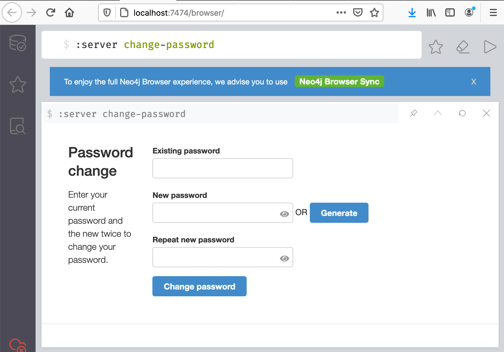

# Neo4j
CEDAR uses `Neo4j` as storage for the following artifacts of CEDAR:

- users
- groups
- categories
- permissions
    

## Install Neo4j

Please install `Neo4j Community Edition`, version 3.5:

???+ warning "Important"

    Do not install Neo4j from a binary. We want to allow usage of `APOC` which will be possible if we install Neo4j from a zip.

Download the package from the distribution site:

```sh
gocedar
wget http://dist.neo4j.org/neo4j-community-3.5.35-unix.tar.gz
# or
wget http://dist.neo4j.org/neo4j-community-3.5.35-windows.zip
```

Once the package is downloaded, unpack it and rename it:

```sh
tar -xvf neo4j-community-3.5.35-unix.tar.gz
mv neo4j-community-3.5.35 neo4j
```

???+ warning "Important"

    Do not start Neo4j yet. We need to set the initial password first.

## Set password for the neo4j user

Neo4j server uses a default username, 'neo4j'. We will change the password for this user before we start the server.

Execute the following:

```sh
JAVA_HOME=$(brew --prefix)/opt/openjdk@11/ && ${CEDAR_NEO4J_HOME}/bin/neo4j-admin set-initial-password changeme
```

## Start Neo4j

```sh
startneo
```

## Check Neo4j status
```sh
cedarss
```

You should see the following line in the output:
```
| Neo4j                      | Running | httpResponse| 7474| HTTP/1.1\s200\sOK |
```


## Check the connection

Connect to the Administrative UI of Neo4j.

Using your browser open: [http://localhost:7474/](http://localhost:7474/)

You will see a page resembling the image below:


Please fill in the form according to these values:

| Question             | Answer                |
|----------------------|-----------------------|
| Connect URL          | bolt://localhost:7687 |
| Authentication type: | Username / Password   |
| Username:            | neo4j                 |
| Password             | changeme              |

You should be able to log in to the system.

## Troubleshooting

### Default password
If by mistake you started `neo4j` before changing the initial password, the password for user `neo4j` will be set to `neo4j`

Log in with this default password. You will be prompted to change it. Change it to `changeme`.

### Change password
If at any time you decide to change the password for the `neo4j` user, log in to the admin UI, and type

```
:server change-password
```

into the top console line, as seen on this picture:



You will be able to change your password.
