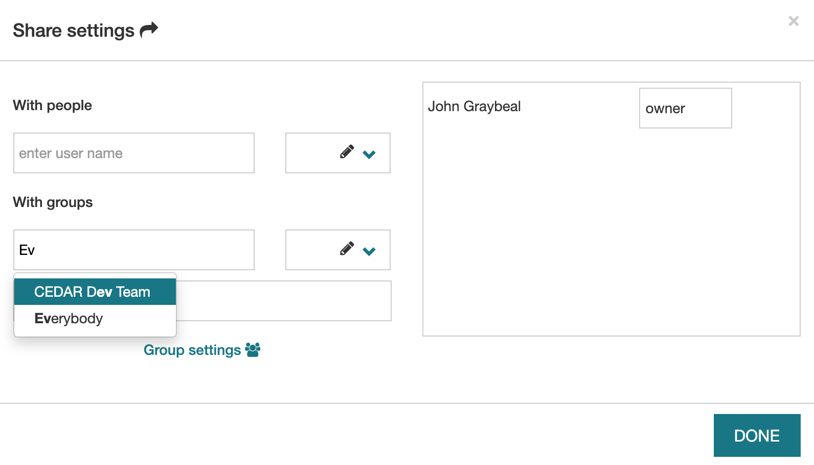
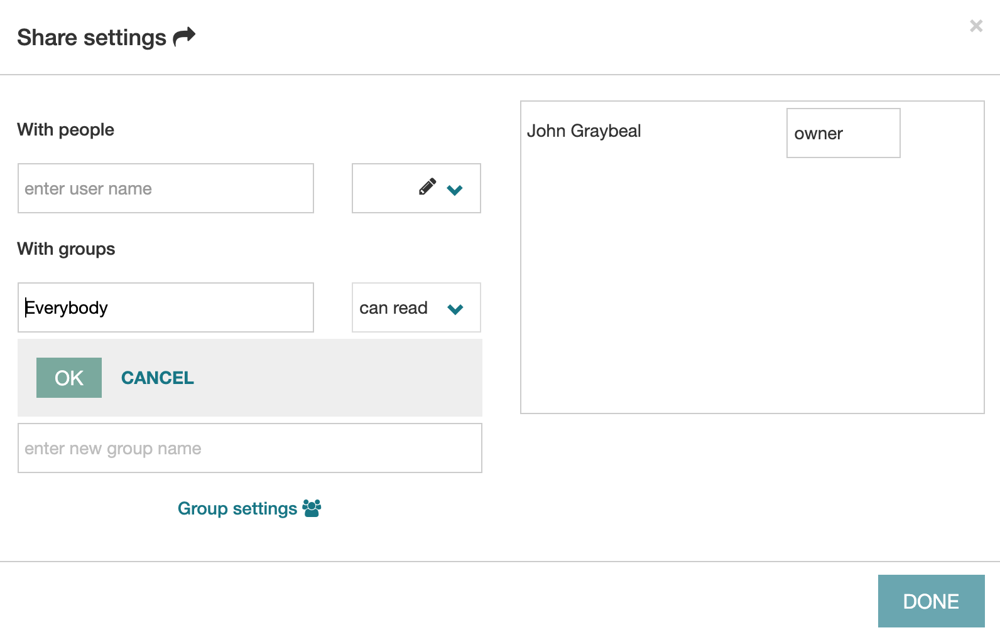
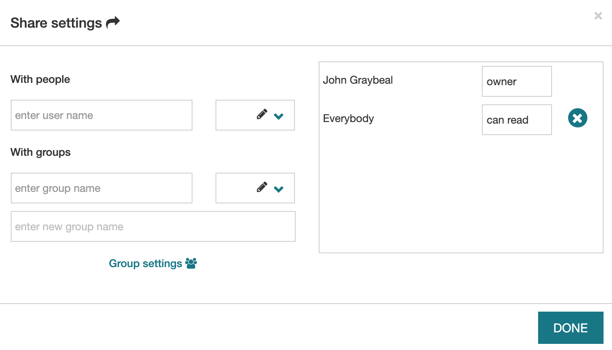
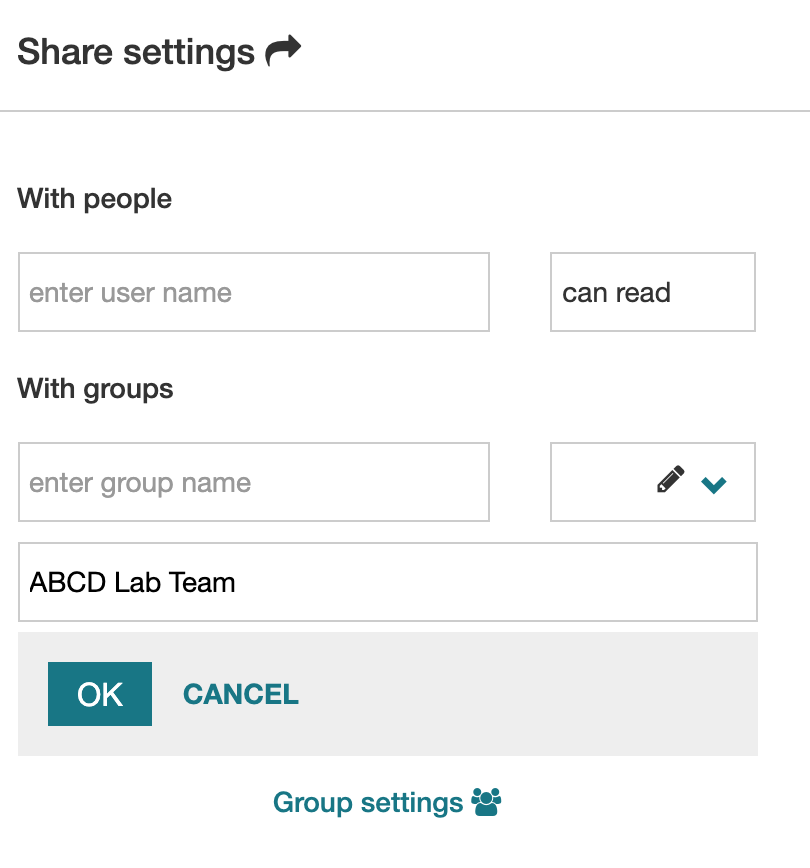
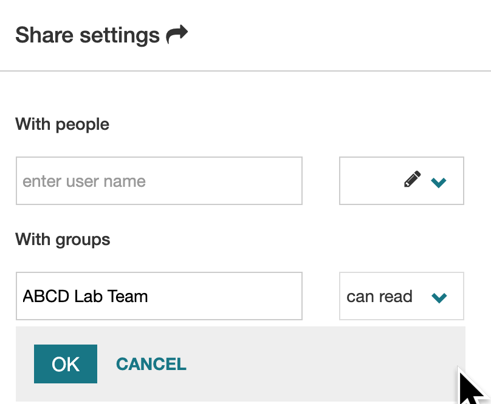
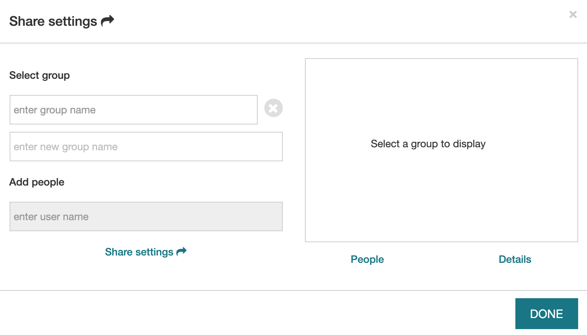

# Creating Groups

## **What Are Groups?**

CEDAR lets you to define groups of people who can share access privileges for particular content. 
For example, if you want members of your team to see all of the metadata generated by your team,
you could put it all in a folder and share the folder's permissions with a group containing your team members.
Or, you could use a group to make metadata visible to a team of curators when it was ready for review.

Any time you want a set of people to share equal access (read or write!) to CEDAR content, you can use a group.

## **Using Groups: Share with Everybody**

Let's say you have created an element and you want to let everyone in CEDAR use it. Good news!
There's a group in CEDAR called Everyone, and if you share your content for reading with that group, 
every CEDAR user can find it and view it. 

To begin, open the sharing menu as described in Sharing for Reading and Writing.

Now, start typing in the name of the Everybody group. As you can see, several groups may be shown,
and you can select the one you want.
{:width="75%" class="centered"}

After you've selected the Everyone group, you can enter the type of sharing (as described in Sharing for Reading and Writing). We highly recommend leaving this 'can read', the default!

To complete the process, you must click on the OK button.
{:width="75%" class="centered"}

Now you should see the group displayed in the right-hand panel, showing the assigned permission.
{:width="75%" class="centered"}

If you had wanted to share your artifact with the CEDAR Dev Team so they can all see it, you could choose that group after typing the 'Ev' above!

## **Creating Groups**

What if you don't have a group yet, but want one?  Instead of entering an existing group name, enter your new group name in the box labeled 'enter new group name'.  Here we've entered ABCD Lab Team for the group name.

{:width="40%" class="centered"}

As soon as you hit return, the group is created, and you can give it read (or write) access permissions by clicking on the OK button.

{:width="40%" class="centered"}

## **Modifying Groups**

Presumably you want to add people to your group. To do this, 
click on the blue Group settings link (pointed to by the green arrow in the screenshot below).

[//]: # (![]&#40;../../../img/userguide/group-settings-xselector-20190909.png&#41;{:width="75%" class="centered"})

This brings up a window in which you have to re-select the group you want to modify.

{:width="75%" class="centered"}

Enter the group you want to make changes to, and when you choose the group name, the people in the group will be displayed.
{:width="75%" class="centered"}

To add someone to the group, start entering their name in the Add people box, select their name from the drop-down list, 
and click on OK. (To remove someone, click on the X by their name.)

To see more information about the group, click on the Detailed info link under the box on the right side. 
This will bring up detailed information about the group, some of which you can edit.
{:width="75%" class="centered"}

## **Group Administration**

You can make multiple people administrators of the group, by checking the appropriate box next to each person's name in the People list.

