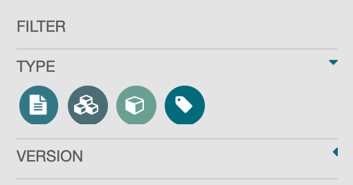
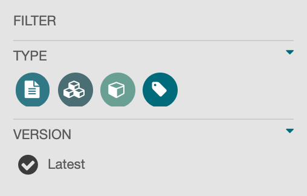
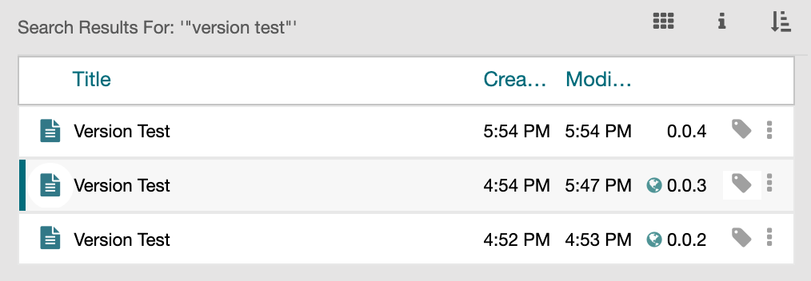
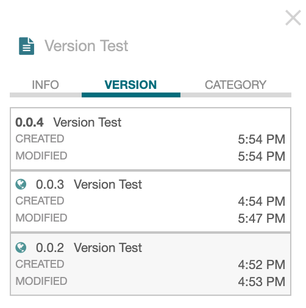

As you build more complex templates, you will start using elements and want to update 
these in your template. Doing so can be a little subtle in CEDAR, 
especially when one wants to use rigorous version control.
In this section, we describe working with CEDAR for these use cases.

## **Updating Fields and Elements**

Once you create a template or element that has nested elements, 
you may find you need to update a lower-level element in your template.
Because the elements are imported as static resources, this is a two-step process.

First, you must update the element that needs to be changed. 
(If it is a versioned resource, follow the instructions in the Creating and Managing Versions topic below.)

After saving your updated element, go to the template that contains it.
Import the updated element as described in [Adding Elements](https://metadatacenter.github.io/cedar-manual/sections/c2/3_adding_elements/); the updated element will appear at the bottom of your form. 

Move the element to the correct location in your form, 
and delete the element that is already there. 

Repeat this process for each updated element that you want to include in the form.
Also be sure to update any other forms that you want to have the updated element.

### Updating Nested Elements

Because imported field and elements are static once imported, 
if you have multiple levels of nested elements and fields,
you must start the re-import process with the lowest-level changes, 
making all changes at the lowest level before re-importing content at the next-highest level.
For example, if Template A contains Element B which imported Field C, 
if you want to change Field C in the parent template you must first modify Field C,
import the modified field into Element B, then import the modified element into Template A.
If there are multiple items changing at a given level in an element, 
all those changes must be made
before that element is re-imported into the parent element or template.

## **Creating and Managing Versions**

CEDAR assigns a version number of `0.0.1` to every new templating artifact 
(templates, elements, and fields). 
You can modify these templating artifacts as often as you want, 
and the version number will not change. 
However, you should not modify a CEDAR template that already has instances;
you will get a warning message if you try to do this. 

Many users want more rigorous control over their artifacts, so that if the artifact is changed,
everyone will be able to see the change has occurred. 
Similarly, users may want to keep older copies of the artifact, 
so they can compare different versions or look up particular versions 
that have been used in the past.

CEDAR uses a 3-number versioning system known as "semantic versioning", 
in which trivial changes are delineated by the right-most number, 
minor changes (with relatively small impact on the overall system) are 
indicated by the middle number, and major changes are shown in the left-hand number.
Each time release a new version, 
you can choose any version representing a higher version number. 
For instance, updating from version 0.0.1 you could choose 0.0.2 
(or any 0.0.x where x is higher than 2), 0.1.y, or
1.y.z as your new version number, where y and z are any number.

### Make Your Artifact Version-Controlled 

To enable such control, CEDAR provides a versioning system for templating artifacts
that is enabled by the `Publish version` menu item. 
When you select Publish version from an artifact's kebob menu,
you will be prompted for your desired version number for your versioned artifact.

Once you select the version and click Save, the artifact named by that version 
will no longer be modifiable, and you will see its version in Desktop resource lists.

### Updating Versioned Artifacts

If you want to create a new version of your artifact,
you must select `Create version` from the artifact's dropdown menu, 
and a new, editable artifact will be created with the right-hand version number
incremented by 1 from the previous artifact. We will call this a draft artifact, 
and it will automatically include metadata referencing the previous version 
as its predecessor. 

You will be able to edit the draft artifact as much as you want, 
but when you are ready to put it under version control, 
you must repeat the Publish version process described above.
Again you can set the version number to any larger sequence 
than the previously published artifact, including the same version as the draft artifact.

As suggested in Updating Nested Elements above, CEDAR templates and elements
import lower-level artifacts in their entirety. 
Thus, later changes to the lower-level artifacts do not change the higher-level artifacts
that import them; the lower-level artifacts must be re-imported.
When new versions of elements or fields are created, 
you must follow the instructions in Updating Fields and Elements above.

The act of publishing an artifact does not change its IRI, 
even if a different version is selected than the draft artifact's version.

## **Finding and Viewing Versioned Artifacts**

When you create and publish new versions of templating artifacts, 
the previously published version is kept on the system, 
and can still be accessed.
However, by default the Workspace and search tools will show only the most recent published version
of an artifact. (If a draft version exists, that will always be shown.)  

{:width="20%" class="right"}
This behavior is controlled by the Version drop-down in the Filter section 
on the left side of the CEDAR Workspace.  
In a typical configuration, the Version drop-down is closed, as shown to the right.

{:width="20%" class="right"}
If you open the Version drop-down, you will see a Latest indicator, 
with a darkened checkbox indicating that viewing the Latest version only is enabled.
Search results and other listings will not show older versions.
{:width="50%" class="centered"}

{:width="20%" class="right"}
To see all versions, click on the Latest item to disable the Latest filter. 
Now, all versions will be shown in any search or folder display that contains them.
{:width="50%" class="centered"}

### Seeing and Navigating to All Artifact Versions

{:width="25%" class="right"}
The version history for any artifact is shown in the Version tab of the metadata panel 
(see image on the right). 
(Click on the 'i' icon to make this panel visible; see
<a href="https://metadatacenter.github.io/cedar-manual/sections/a3/5_viewing_resource_metadata/">Viewing Resource Details</a> for more information.)  

In the metadata panel example, 
you can see the three versions of the Version Test artifact. 
The Version tab shows all the versions available for the selected artifact, 
no matter the setting of the Version drop-down in the Filter section.
The world icon indicates the artifact is published; an artifact without that icon is a draft.

To open any of the versions listed in the metadata panel,
click on that version's title ("Version Test") in the list.
The Template Designer will be opened with the appropriate version of the artifact.
There can be only one draft version open for any published artifact,
and that draft version is always more current than any of the published versions
of that artifact.

